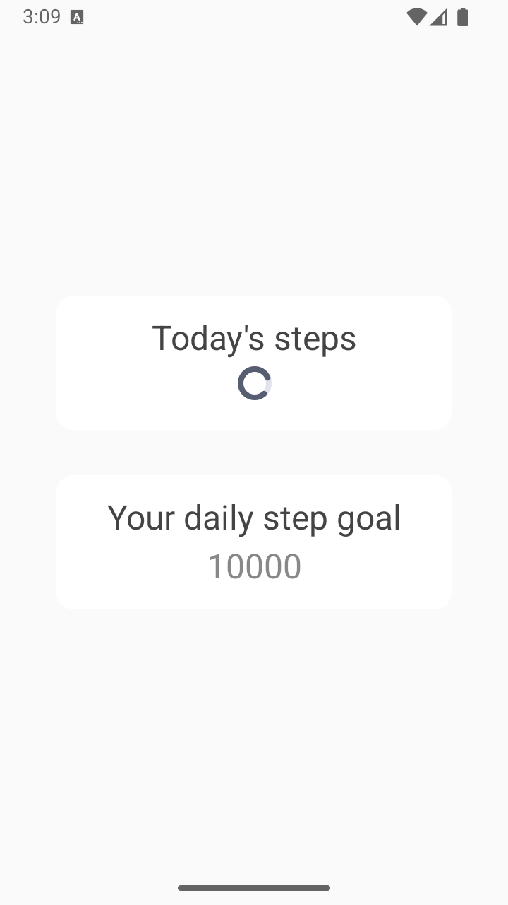
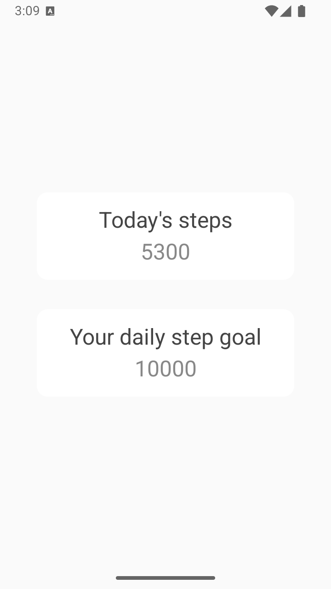
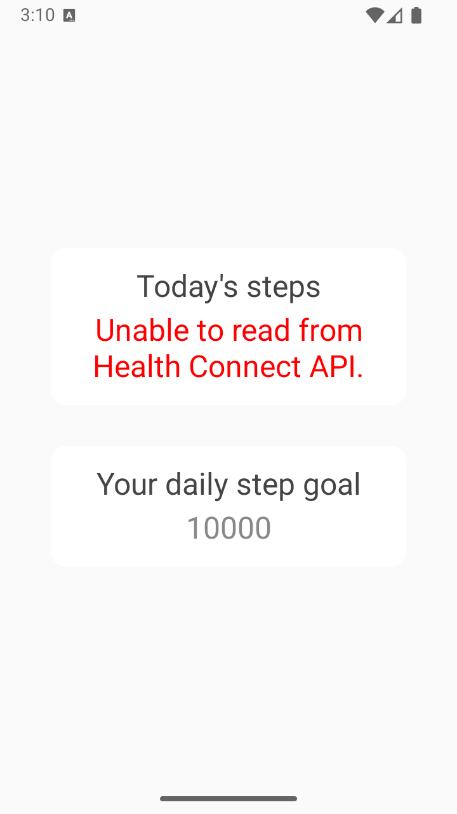

# Android (Full Implementation)

## Build

+ Open Android Studio
+ File > Open > Select <PreffectTakeHomeRoot>/android folder > Ok/Open
+ File > Sync Project with Gradle Files
+ Build > Make Project

## Deploy application

### 1. Create AVD or connect your phone

+ To create a new android virtual device, select Tools > Device Manager
+ Select Create Virtual Device
+ In the Virtual Device Configuration, select Pixel 9 > Next
+ Select the VanillaIceCream API 35 release with Google Play > Next
+ Finish

### 2. Run app on device
+ Run > Select Device...
+ Select your device/AVD
+ Run > Run 'app'

## Run unit tests

+ File > Sync Project with Gradle Files
+ In the Project view panel on the left, select "Project" from the dropdown.
+ Right click on the "android/app/src/test" folder and select "Run 'Tests in Preffect_Fitness_Tracker'" 

## CI/CD

+ The CI is run using a GitHub Actions Workflow found in ./github/workflows/android.yml
+ Every time code is pushed to the master branch with changes in the android directory, the jobs will get triggered.
+ Jobs can also be run manually in the GitHub Actions tab of the repository.
+ Currently only build and test jobs are configured for Android. 
+ The jobs would be expanded to include building a release version of the app and publishing it to the Google Play store.
+ Additionally, all jobs would be built and ran for iOS.

## Tehcnical Overview

+ Dependency graph is resolved using the dependency injection libraries Hilt/Dagger. Using DI helps with testing by making it easy to insert mock dependencies and makes it easy to refactor a service like Google Fit API with the new Health Connect API.
+ Network requests are currently run through the Ktor networking library, which uses OkHttp under the hood, making it possible to pull out that module and use in a KMP project.
+ Multithreading is achieved using kotlin coroutines.
+ Views are written using Jetpack Compose instead of directly using the Android framework, since they are written with reactivity in mind. 
+ The app architecture follows modern Android guidelines by using ViewModels, Repositories and DataSources to separate remote and local data.

## Additional TODO
+ Swap the FitnessStubbedDataSource with one that fetches step count from the Health Connect API.
+ Modularize the app into features to support a larger project. Currently, it's a simple screen and doesn't need a complex architecture. If we were to add more features, we would refactor the data, common and UI code into sepearte android modules. This modularization would help multiple engineers work on separate parts of each app without disturbing each other's work. It would also enable custom Play Store updates/delivery.
+ Adding local persistence to each application, such as Room and SwiftData. This lets us quickly show the user a populated UI while giving the app time to fetch updates.
+ Implement a CI/CD pipeline to run tests, build and deploy the applications to their respective stores. The features of this CI/CD are described in the CI/CD section of the README.
+ Write more tests for better coverage.
+ Potentially implement Service or WorkManager for long running network requests. E.g. if our network requests take some long period of time, we can run them in the background, populate our DB, and update the UI with the DB as the source of data.
+ Perform app profiling to optimize/find slow tasks.
+ Use proguard/R8 to minify and obfuscate our final dex code.
+ There's no authentication for our network calls. We would evevntually need some authentication system in our app.

# iOS

## Build

+ Open Xcode
+ Select "Open Existing Project"
+ Navigate to the project folder and select the "<PreffectTakeHomeRoot>/ios/Preffect Fitness Tracker.xcodeproj" File
+ Click "Open"
+ In the toolbar, select "Product" > "Scheme" > "Choose Scheme" and select "Preffect Fitness Tracker"
+ In the toolbar, select "Product" > "Destination" > and select "iPhone 16 Pro"
+ In the toolbar, select "Product" > "Build"

## Deploy application

+ In the toolbar, select "Product" > "Run"